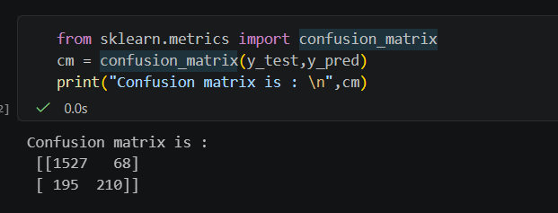
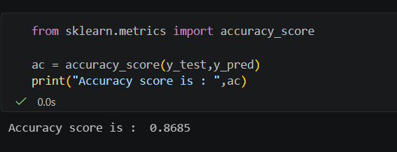

# 🧠 Customer Churn Prediction using Artificial Neural Network (ANN)

## 📌 Project Overview

This project implements an **Artificial Neural Network (ANN)** using **TensorFlow/Keras** to predict whether a bank customer is likely to leave (churn) or remain with the bank.

The model is trained on the **Churn Modelling Dataset** and demonstrates the complete deep learning workflow, including:

* Data preprocessing
* Feature encoding
* Feature scaling
* Train-Test split
* ANN model creation
* Model training and validation
* Prediction and evaluation

---

## 🚀 Technologies Used

| Technology         | Purpose                         |
| ------------------ | ------------------------------- |
| Python             | Programming Language            |
| TensorFlow / Keras | Deep Learning Framework         |
| NumPy              | Numerical Computations          |
| Pandas             | Data Manipulation               |
| Scikit-learn       | Data Preprocessing & Evaluation |
| Matplotlib         | Data Visualization              |

---

## 📂 Project Structure

```text
Customer-Churn-ANN/
│
├── ann_churn.ipynb
├── Churn_Modelling.csv
├── README.md
│
└── screenshots/
    ├── confusion_matrix.png
    └── prediction_output.png
```

---

## 📊 Dataset Information

The dataset contains customer information such as:

* Credit Score
* Geography
* Gender
* Age
* Tenure
* Balance
* Number of Products
* Has Credit Card
* Is Active Member
* Estimated Salary

### Target Variable

```text
Exited
```

* 1 → Customer Left the Bank
* 0 → Customer Stayed

---

## ⚙️ Data Preprocessing

### Label Encoding

Gender column is converted into numerical values.

```python
from sklearn.preprocessing import LabelEncoder
```

### One-Hot Encoding

Geography column is transformed using:

```python
OneHotEncoder()
```

### Feature Scaling

Features are standardized using:

```python
StandardScaler()
```

---

## 🧠 ANN Architecture

The model consists of:

### Input Layer

```python
Dense(units=6)
```

### Hidden Layer 1

```python
Dense(units=6, activation='relu')
```

### Hidden Layer 2

```python
Dense(units=5, activation='relu')
```

### Hidden Layer 3

```python
Dense(units=4, activation='relu')
```

### Output Layer

```python
Dense(units=1, activation='sigmoid')
```

---

## 🔧 Model Compilation

```python
ann.compile(
    optimizer='adam',
    loss='binary_crossentropy',
    metrics=['accuracy']
)
```

### Optimizer

* Adam

### Loss Function

* Binary Crossentropy

### Evaluation Metric

* Accuracy

---

## 🏋️ Model Training

```python
ann.fit(
    X_train,
    y_train,
    batch_size=32,
    epochs=50,
    validation_data=(X_test, y_test)
)
```

### Training Parameters

| Parameter  | Value |
| ---------- | ----- |
| Epochs     | 50    |
| Batch Size | 32    |
| Optimizer  | Adam  |

---

## 📈 Model Evaluation

### Accuracy Score

```python
accuracy_score(y_test, y_pred)
```

### Confusion Matrix

```python
confusion_matrix(y_test, y_pred)
```

The model performance is evaluated using:

* Accuracy Score
* Confusion Matrix

---

## 📸 Project Screenshots

### Confusion Matrix





### Prediction Output





---

## ▶️ Installation

Clone the repository:

```bash
git clone https://github.com/your-username/customer-churn-ann.git
```

Navigate to the project folder:

```bash
cd customer-churn-ann
```

Install dependencies:

```bash
pip install -r requirements.txt
```

---

## 🏃 Run the Project

Open Jupyter Notebook:

```bash
jupyter notebook
```

Run:

```text
ann_churn.ipynb
```

---

## 📋 Requirements

```text
tensorflow
numpy
pandas
matplotlib
scikit-learn
jupyter
```

---

## 🎯 Learning Outcomes

* Deep Learning Fundamentals
* Artificial Neural Networks (ANN)
* TensorFlow/Keras Model Development
* Data Preprocessing Techniques
* Binary Classification Problems
* Model Evaluation Techniques

---

## 👨‍💻 Author

**Manas Ranjan Meher**

🔗 GitHub: https://github.com/manasranjanmeher99

🔗 LinkedIn: https://www.linkedin.com/in/manas-ranjan-meher-606181280/

---

⭐ If you found this project useful, don't forget to star the repository.
