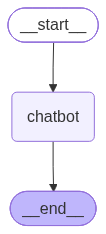

# 🚀 LangGraph Learning Repository

<div align="center">


Learn **LangGraph** from scratch through practical Jupyter notebooks, covering graph-based AI workflows, chatbot development, state management, and LangChain integration.

</div>

---

# 📚 Repository Contents

This repository contains two beginner-friendly notebooks:

| Notebook | Description |
|----------|-------------|
| **langgraph-quickstart.ipynb** | Introduction to LangGraph, StateGraph, Nodes, Edges, and Graph Execution |
| **langgraph.ipynb** | Building an AI Chatbot using LangGraph, LangChain, and Groq LLM |

---

# 📂 Project Structure

```text
LangGraph-Learning/
│
├── notebooks/
│   ├── langgraph.ipynb
│   └── langgraph-quickstart.ipynb
│
├── images/
│   └── graph.png
│
├── requirements.txt
├── .gitignore
└── README.md
```

---

# 🛠 Technologies Used

- Python
- LangGraph
- LangChain
- LangChain-Groq
- Groq API
- Jupyter Notebook

---

# ✨ Topics Covered

## LangGraph Fundamentals

- StateGraph
- Nodes
- Edges
- START Node
- END Node
- Graph Compilation
- Graph Execution
- State Management

---

## LangGraph Chatbot

- ChatGroq Integration
- Llama 3 Models
- Message State
- AI Chat Workflow
- Graph Invocation
- Conversation Flow
- Response Generation

---

# 🧠 Workflow

```text
             User Input
                  │
                  ▼
          StateGraph Starts
                  │
                  ▼
            AI Chat Node
                  │
                  ▼
         LLM (Groq / Llama)
                  │
                  ▼
        Generate AI Response
                  │
                  ▼
             Update State
                  │
                  ▼
                 END
```

---

# 📊 Graph Architecture


<div align="center">



</div>

---


# 📦 Installation

Clone the repository

```bash
git clone https://github.com/manasranjanmeher99/LangGraph-Learning.git
```

Move into the project

```bash
cd LangGraph-Learning
```

Install dependencies

```bash
pip install -r requirements.txt
```

---

# 📄 Requirements

```
langgraph
langchain
langchain-core
langchain-groq
groq
typing_extensions
jupyter
ipython
```

---

# 🔑 Configure API Key

```python
from langchain_groq import ChatGroq

llm = ChatGroq(
    model="llama-3.3-70b-versatile",
    api_key="YOUR_GROQ_API_KEY"
)
```

> **Note:** Replace `YOUR_GROQ_API_KEY` with your own Groq API key.

---

# ▶️ Run the Notebooks

Launch Jupyter Notebook:

```bash
jupyter notebook
```

Then open:

- `langgraph-quickstart.ipynb`
- `langgraph.ipynb`

Run all cells sequentially.

---

# 🎯 Learning Outcomes

After completing these notebooks, you will understand:

- ✅ LangGraph Basics
- ✅ StateGraph
- ✅ Graph Nodes
- ✅ Graph Edges
- ✅ START & END Nodes
- ✅ AI Workflow Design
- ✅ State Management
- ✅ LangChain Integration
- ✅ Groq LLM Integration
- ✅ Building AI Chatbots
- ✅ Graph Compilation & Execution

---

# 🚀 Future Improvements

- Memory Support
- Tool Calling
- Human-in-the-Loop
- Multi-Agent Systems
- RAG with LangGraph
- Conditional Edges
- Parallel Execution
- Agent Supervisor
- Streaming Responses

---

# 🤝 Contributing

Contributions are welcome!

1. Fork the repository.
2. Create a feature branch.
3. Commit your changes.
4. Open a Pull Request.

---

# ⭐ Support

If you found this repository helpful, please consider giving it a ⭐ on GitHub.

---

<div align="center">

### Happy Learning with LangGraph! 🚀

</div>
