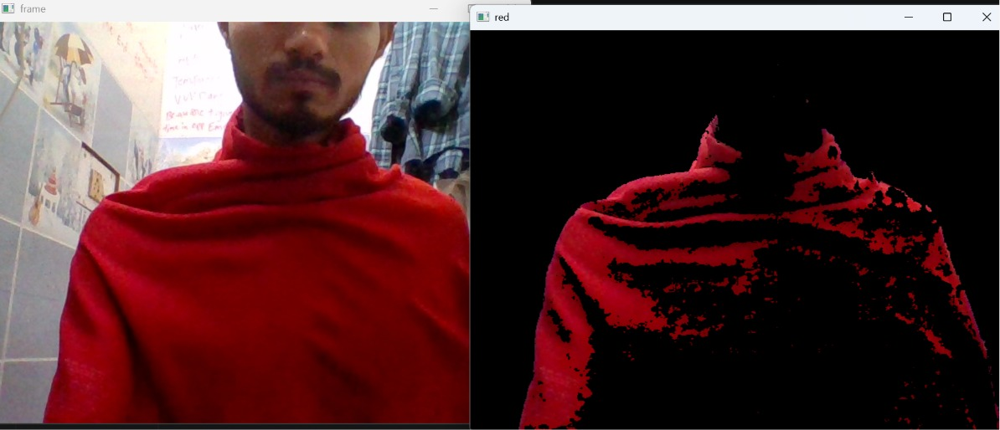
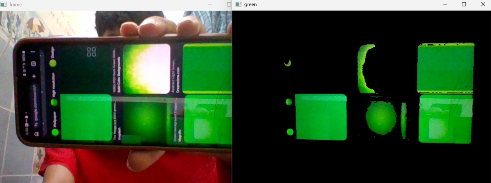
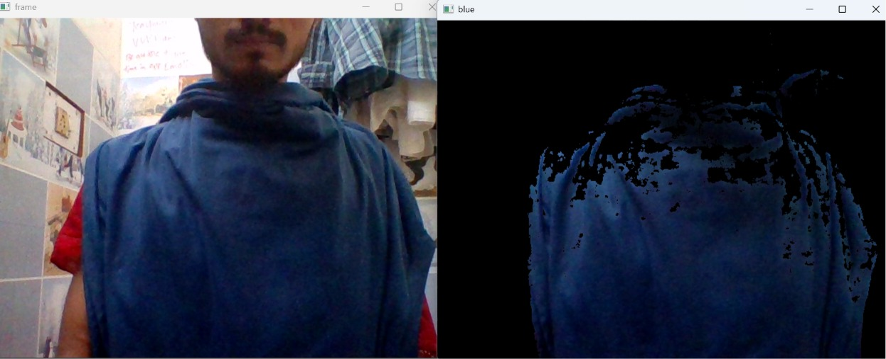
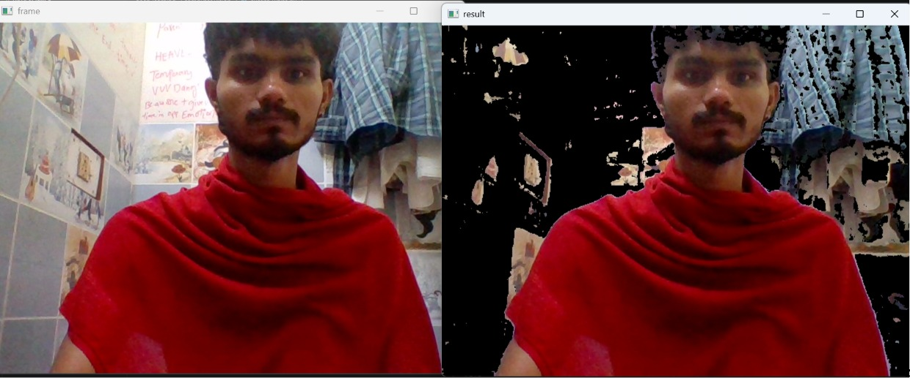

# 🎨 Color Detection using OpenCV

A beginner-friendly Computer Vision project that demonstrates **real-time color detection** using **OpenCV**, **NumPy**, and the **HSV (Hue, Saturation, Value)** color space. The project includes multiple Python scripts to detect different colors from a webcam feed by creating color masks.

---

## 📌 Features

- 🔴 Detect Red Color
- 🟢 Detect Green Color
- 🔵 Detect Blue Color
- ⚪ Detect All Colors Except White
- 🎥 Capture Live Webcam Video
- 🎨 Learn HSV Color Space for Color Segmentation
- ⚡ Real-time Object Detection using Color Masks

---

## 📂 Project Structure

```text
color_detection/
│
├── blue_mask_detection.py      # Detect blue objects
├── capture_video.py            # Capture live webcam video
├── except_white.py             # Detect all colors except white
├── green_mask_detection.py     # Detect green objects
├── HCV_color.py                # HSV color space demonstration
├── red_color_mask.py           # Detect red objects
│
├── preview/
│   ├── blue_detection.jpeg
│   ├── green_detection.jpeg
│   ├── red_detection.jpeg
│   └── except_white.jpeg
│
├── requirements.txt
└── README.md
```

---

## 🛠️ Technologies Used

- Python 3.x
- OpenCV
- NumPy

---

## 📦 Installation

### 1️⃣ Clone the repository

```bash
git clone https://github.com/manasranjanmeher99/Deep-Learning/tree/main/color_detection.git
```

### 2️⃣ Navigate to the project

```bash
cd color_detection
```

### 3️⃣ Install dependencies

```bash
pip install -r requirements.txt
```

---

## ▶️ Running the Programs

### 🎥 Capture Webcam

```bash
python capture_video.py
```

### 🔴 Red Color Detection

```bash
python red_color_mask.py
```

### 🟢 Green Color Detection

```bash
python green_mask_detection.py
```

### 🔵 Blue Color Detection

```bash
python blue_mask_detection.py
```

### ⚪ Detect Everything Except White

```bash
python except_white.py
```

### 🎨 HSV Color Detection Demo

```bash
python HCV_color.py
```

---

## 💡 How It Works

1. Capture live frames from the webcam.
2. Convert each frame from **BGR** to **HSV** color space.
3. Define lower and upper HSV ranges for the desired color.
4. Create a binary mask using `cv2.inRange()`.
5. Apply the mask to the original frame using `cv2.bitwise_and()`.
6. Display the detected colored objects in real time.

---

## 📸 Project Screenshots

### 🔴 Red Color Detection



---

### 🟢 Green Color Detection



---

### 🔵 Blue Color Detection



---

### ⚪ Except White Detection



---


## 📚 Learning Concepts

- OpenCV Basics
- Image Processing
- HSV Color Space
- Color Thresholding
- Binary Masking
- Bitwise Operations
- Webcam Video Capture
- Real-Time Computer Vision

---

## 📋 Requirements

```
opencv-python
numpy
```

Install manually if needed:

```bash
pip install opencv-python numpy
```

---

## 🚀 Future Improvements

- Detect multiple colors simultaneously
- Add trackbars for dynamic HSV tuning
- Save detected images automatically
- Detect colored objects in uploaded images
- Object tracking based on color
- Improve noise removal using morphological operations

---

## 🤝 Contributing

Contributions are welcome!

1. Fork the repository
2. Create a feature branch

```bash
git checkout -b feature-name
```

3. Commit your changes

```bash
git commit -m "Added new feature"
```

4. Push to GitHub

```bash
git push origin feature-name
```

5. Open a Pull Request

---

## ⭐ Support

If you found this project helpful, please consider giving it a ⭐ on GitHub.

---


## 👨‍💻 Author

**Manas Ranjan Meher**

GitHub: https://github.com/manasranjanmeher99
