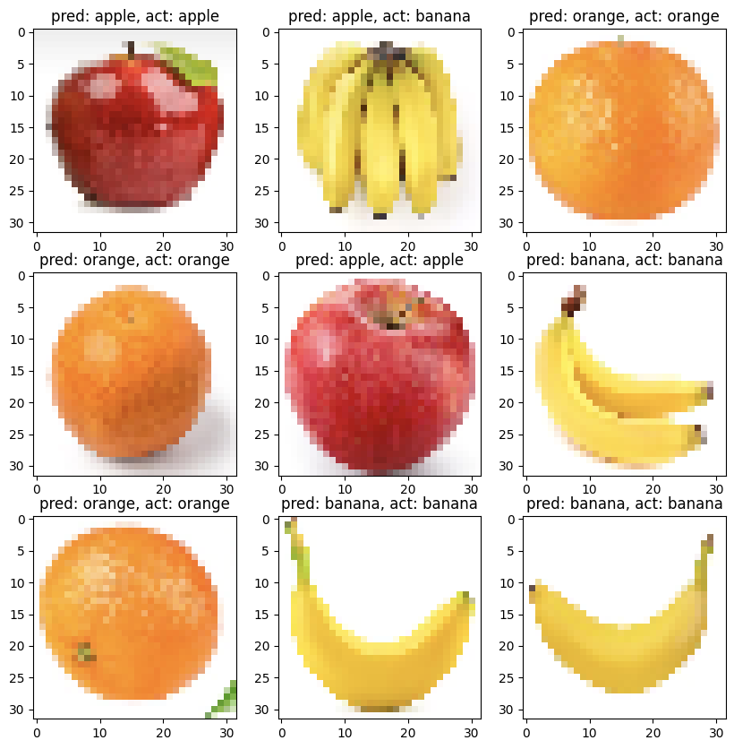

# 🍎🍌🍊 Multiclass Image Classification using TensorFlow CNN

A deep learning project that classifies fruit images into **Apple**, **Banana**, and **Orange** using a Convolutional Neural Network (CNN) built with **TensorFlow/Keras**. The trained model is also converted into a **TensorFlow Lite (TFLite)** model for deployment on mobile and edge devices.

---

# 📌 Project Overview

This project demonstrates how to build a complete image classification pipeline using TensorFlow.

The notebook performs the following tasks:

* Downloads a fruit image dataset
* Loads images using TensorFlow Dataset API
* Visualizes training images
* Builds a CNN model
* Trains the model
* Evaluates model performance
* Predicts classes for unseen images
* Converts the trained model to TensorFlow Lite

---

# 📂 Project Structure

```text
multiclass_classification/
│
├── multiclass_classification.ipynb
├── fruits/
│   ├── train/
│   │   ├── apple/
│   │   ├── banana/
│   │   └── orange/
│   │
│   ├── validation/
│   └── test/
│
├── output/
│   ├── output1.png
│   └── output2.png
├── model.tflite
├── README.md
└── requirements.txt
```

---

# 🚀 Technologies Used

* Python
* TensorFlow
* Keras
* NumPy
* Matplotlib

---

# 📊 Dataset

The notebook downloads a prepared fruit dataset containing three classes:

* 🍎 Apple
* 🍌 Banana
* 🍊 Orange

Dataset folders:

```
fruits/
    train/
    validation/
    test/
```

Each folder contains images organized by class.

---

# ⚙️ Code Explanation

## 1️⃣ Checking GPU Availability

```python
!nvidia-smi
```

This command displays GPU information.

If a GPU is available, TensorFlow training becomes significantly faster.

---

## 2️⃣ Downloading Dataset

```python
!wget ...
```

Downloads the fruit dataset.

---

## 3️⃣ Extracting Dataset

```python
!unzip fruits.zip
```

Extracts the dataset into the working directory.

---

## 4️⃣ Importing Libraries

```python
import tensorflow as tf
import matplotlib.pyplot as plt
```

Required libraries:

* TensorFlow for deep learning
* Matplotlib for visualization

---

## 5️⃣ Loading Image Dataset

```python
train_ds = tf.keras.utils.image_dataset_from_directory(...)
```

TensorFlow automatically:

* Reads images
* Assigns labels
* Creates batches
* Shuffles training data

Image size:

```
32 × 32
```

Batch size:

```
20
```

Datasets created:

* Training
* Validation
* Testing

---

## 6️⃣ Visualizing Images

```python
plt.imshow(...)
```

Displays sample images along with their class labels.

Example output:

```
Apple
Banana
Orange
```

This helps verify that the dataset has been loaded correctly.

---

## 7️⃣ Building the CNN Model

The model consists of multiple convolutional layers.

Architecture:

```
Input Image
      │
Rescaling
      │
Conv2D (32)
      │
MaxPooling
      │
Conv2D (64)
      │
MaxPooling
      │
Conv2D (128)
      │
MaxPooling
      │
Flatten
      │
Dense (128)
      │
Dense (3 Output Classes)
```

### Layer Description

### Rescaling

```python
Rescaling(1./255)
```

Normalizes pixel values from

```
0–255
```

to

```
0–1
```

---

### Conv2D Layers

Extract image features such as

* edges
* curves
* textures
* object shapes

Three convolution layers are used:

* 32 filters
* 64 filters
* 128 filters

---

### MaxPooling

Reduces feature map size.

Benefits:

* Faster training
* Less memory
* Reduces overfitting

---

### Flatten

Converts feature maps into a 1D vector.

---

### Dense Layer

Learns high-level relationships among extracted features.

---

### Output Layer

Contains

```
3 neurons
```

corresponding to:

* Apple
* Banana
* Orange

---

# 8️⃣ Compiling the Model

```python
model.compile(...)
```

Configuration:

Optimizer

```
RMSprop
```

Loss Function

```
SparseCategoricalCrossentropy
```

Metric

```
Accuracy
```

---

# 9️⃣ Training the Model

```python
model.fit(...)
```

Training uses:

* Training dataset
* Validation dataset

Number of epochs:

```
20
```

During training TensorFlow displays:

* Loss
* Validation Loss
* Accuracy
* Validation Accuracy

---

# 🔟 Evaluating the Model

```python
model.evaluate(test_ds)
```

Tests the trained model on unseen images.

Outputs:

* Test Loss
* Test Accuracy

---

# 1️⃣1️⃣ Making Predictions

```python
model.predict(images)
```


Predictions are obtained for the test images.

For each image, the notebook displays:

```
Predicted Class

Actual Class
```

Example:

```
Pred: Apple
Actual: Apple
```

This helps visually inspect model performance.

---

# 1️⃣2️⃣ Converting to TensorFlow Lite

```python
converter = tf.lite.TFLiteConverter.from_keras_model(model)
```

The trained model is converted into

```
model.tflite
```

Advantages:

* Smaller size
* Faster inference
* Suitable for Android
* Suitable for Raspberry Pi
* Suitable for Edge AI devices

---

# 🧠 CNN Workflow

```
Image
   │
Resize
   │
Normalization
   │
Convolution
   │
Pooling
   │
Convolution
   │
Pooling
   │
Flatten
   │
Dense Layer
   │
Output Layer
   │
Prediction
```

---

# ▶️ How to Run

## Clone Repository

```bash
git clone https://github.com/yourusername/multiclass_classification.git
```

---

## Install Dependencies

```bash
pip install -r requirements.txt
```

---

## Run Notebook

```bash
jupyter notebook
```

Open

```
multiclass_classification.ipynb
```

Run all cells.

---

# 📈 Expected Results

The model learns to classify:

* 🍎 Apple
* 🍌 Banana
* 🍊 Orange

After training, it predicts the correct fruit class for unseen images and exports a deployable **TensorFlow Lite** model.

---

# 🎯 Future Improvements

* Increase image resolution (e.g., 128×128 or 224×224)
* Add data augmentation
* Apply Dropout to reduce overfitting
* Use Transfer Learning (MobileNetV2, EfficientNet, ResNet50)
* Plot training accuracy and loss curves
* Generate a confusion matrix
* Deploy as a web application using Streamlit or Flask
* Build an Android application using the exported TFLite model

---

# 👨‍💻 Author

**Manas Ranjan Meher**

Deep Learning • Computer Vision • Machine Learning • TensorFlow
